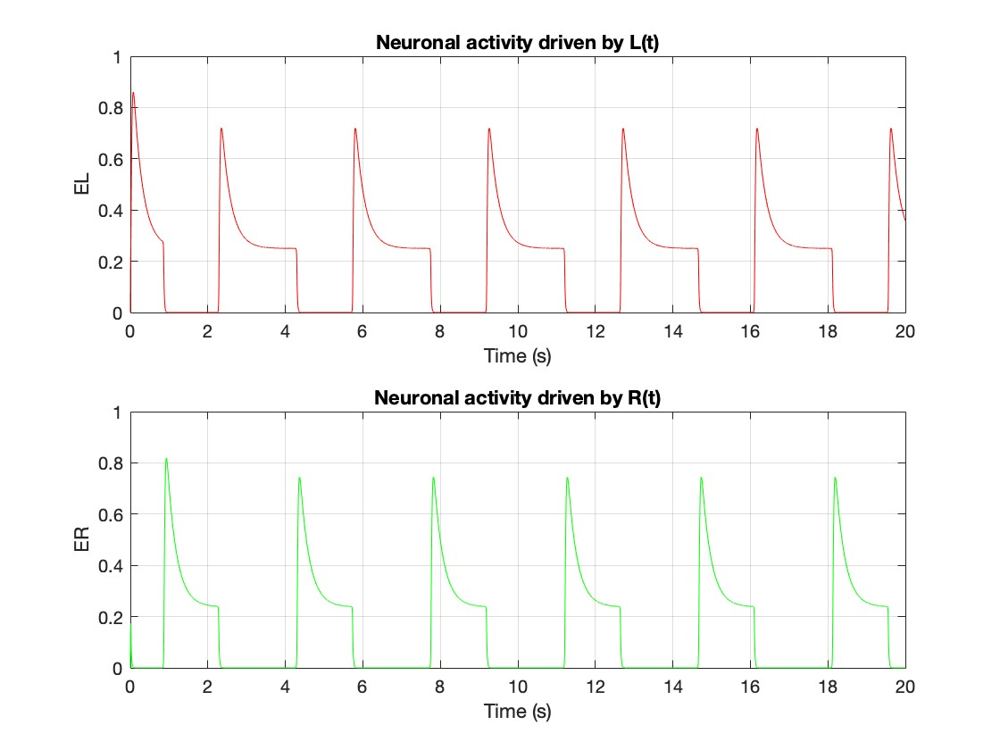
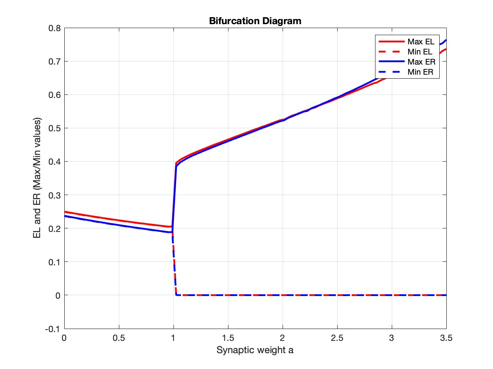
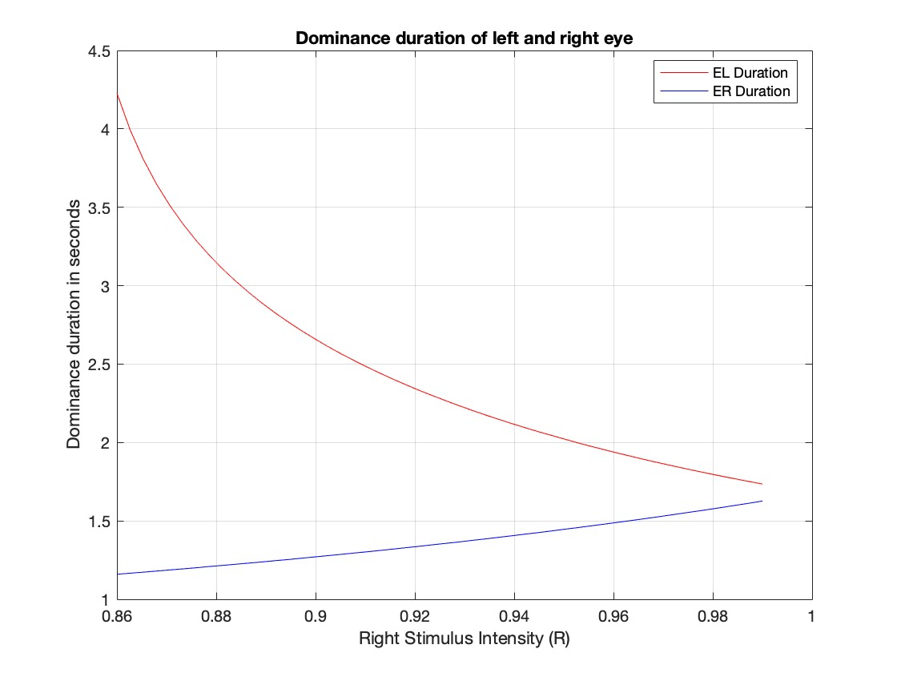
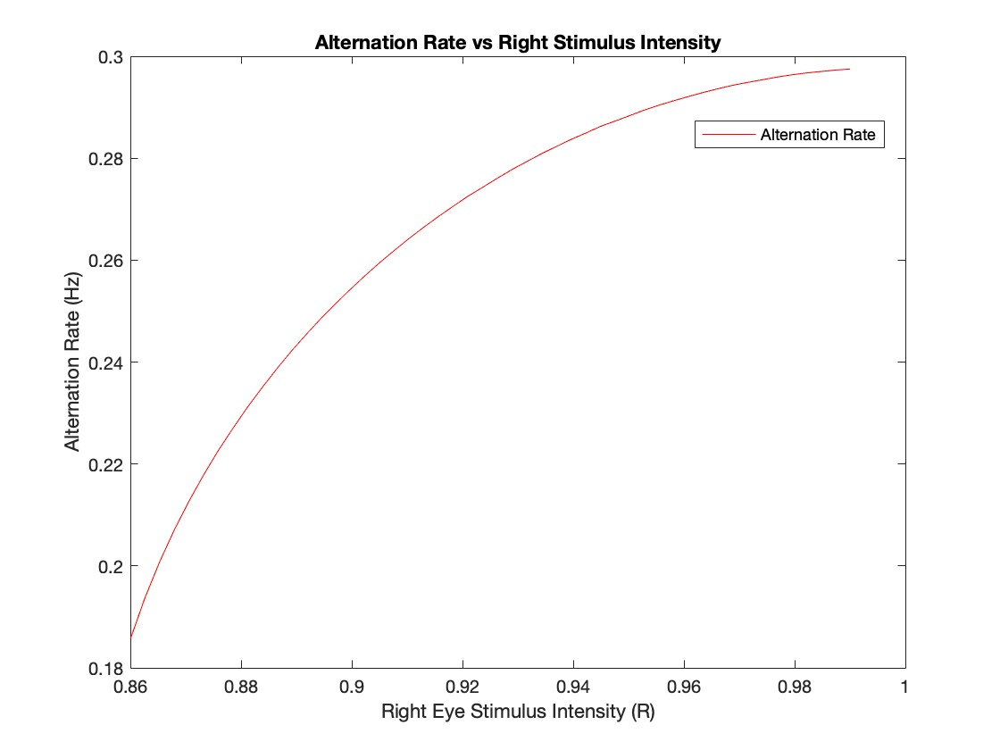

# Binocular Rivalry Model Project

## THE PROBLEM:

Binocular rivalry is a remarkable phenomenon of vision. When two dissimilar images are presented simultaneously to each eye, perception alternates between them. For example, if the left eye views horizontal lines and the right eye views vertical lines, the observer will report seeing vertical lines for a few seconds, then horizontal ones, then vertical ones again, and so on.

Binocular rivalry is a popular tool for studying perception and awareness, because perception changes even though the physical stimulus does not. The rate at which perception alternates between the two images and the relative duration of each image during a perception cycle depend particularly on the intensity (for instance, contrast) of the two images. These dependencies have been formalized by four of Levelt’s laws.

In his paper, H.R. Wilson proposed a simple population model for binocular rivalry, made of four differential equations:

$$\\tau \\dot{E}_L(t) = -E_L(t) + mS(L(t) - aE_R(t) + \\epsilon E_L(t) - gH_L(t))$$
$$\\tau_H \\dot{H}_L(t) = -H_L(t) + E_L(t)$$
$$\\tau \\dot{E}_R(t) = -E_R(t) + mS(R(t) - aE_L(t) + \\epsilon E_R(t) - gH_R(t))$$
$$\\tau_H \\dot{H}_R(t) = -H_R(t) + E_R(t)$$

Where:
- `L(t)` is the intensity of the stimulus on the left eye, ranging between 0 and 1.
- `R(t)` is the intensity of the stimulus on the right eye, also ranging between 0 and 1.
- `E_L(t)` represents the neuronal activity driven by the left eye stimulus and is always non-negative.
- `E_R(t)` represents the neuronal activity driven by the right eye stimulus and is non-negative as well.
- `a` is a positive inhibitory synaptic weight.
- The constants are: `τ = 15 ms`, `τ_H = 1 s`, `m = 1`, and `g = 3`.
- `ε` and `g` are positive excitatory synaptic weights.
- `m` describes the excitability of each neuronal population.
- `H_L(t)` and `H_R(t)` represent slow hyperpolarizing currents and are non-negative.
- `τ` and `τ_H` are positive time constants.
- `S(x)` is the activation function, defined as `S(x) = max(0, x)` for all `x ∈ ℝ`.

## THIS PROJECT:

This Matlab project solves this model and includes:

### Time Evolution of E_L(t) and E_R(t):

### Bifurcation Study for Parameter a:

### Levelt's Laws Validation:

- **Levelt’s Second Law:** "Increasing the intensity of the stimulus at one eye tends to decrease the perceptual dominance of the other eye."
  
  

- **Levelt’s Third Law:** "Increasing the stimulus strength at one eye increases the perceptual alternation rate."
  
  

The project also includes the implementation of spike counting to calculate the dominance time and alternation rate based on the model's output signals.